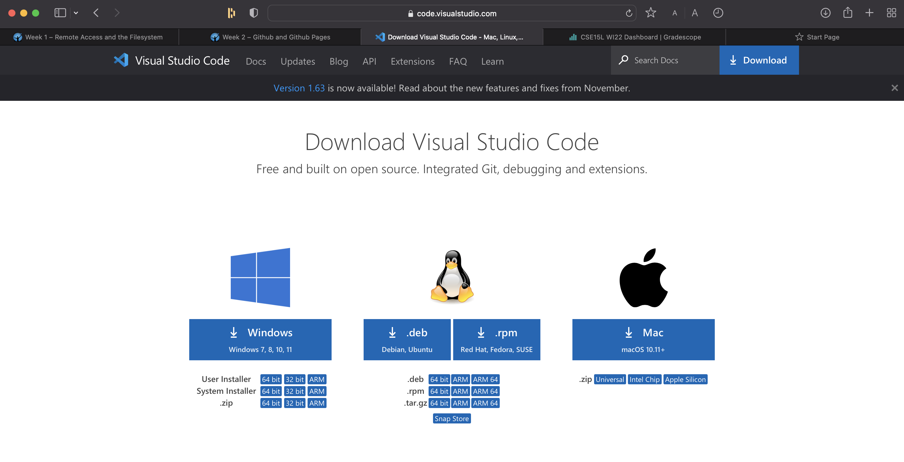

# Lab Report 1

Here are the steps you should take to log into a course specific account on ieng6

### Step 1: Install VSCODE

[VSCODE](https://code.visualstudio.com/Download)

- Use the link above to download VSCODE.
- Choose the appropriate version based on the os you are running.

### Step 2: Remotely Connecting

[Get Your Account](https://sdacs.ucsd.edu/~icc/index.php)

- Look up your account using the link above.
- In terminal, input 'ssh cs15lwi22zz@ieng6.ucsd.edu' but switch the zz with your username. Then input your password.

### Step 3: Run Some Commands

- Run some commands to get acquainted with them, as they are quite useful.
- Examples of commands cd, ls -lat, cat /home/linux/ieng6/cs15lwi22/public/hello.txt, etc

### Step 4: Moving Files Over SSH with scp

- Run scp on the client (your computer). Put in the file you wish to transfer and the location of the transfer.
- After you log into ineg6, you will be able to see the file you transferred once you call ls.

### Step 5: SSH Keys

- Call ssh-keygen on the client and assign the location of where to save the key.
- Log into the server and create a directory marked .ssh
- Use scp to transfer the key to the server, and you should now be able to log into the server without the password.

### Step 6: Optimizing Remote Running

- There are many commands one can use to make remote running easier for the user.
- Use the up arrows to run a previous command.
- You can use semi-colons to run multiple commands on the same line.