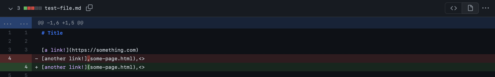
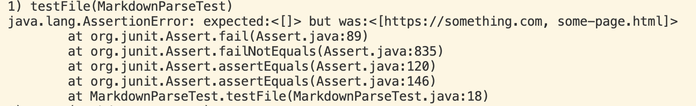
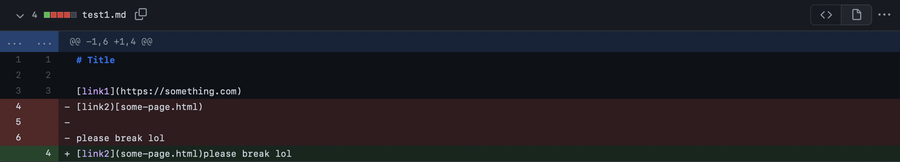
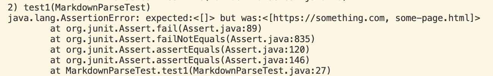
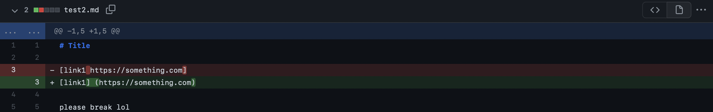
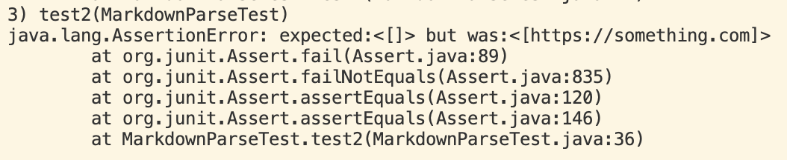

# Lab Report 2

### Code change 1: test-file.md

[Link](https://rkhateeb.github.io/cse15l-lab-reports/test-file.html)

- For this code, I added a comma followed by two angle brackets (<>).
- This caused the code to run in an infinite loop and not return anything.
- When compiled and run, nothing happens; code does not end unless you do command c to kill program.

### Code change 2: test1.md

[Link](https://rkhateeb.github.io/cse15l-lab-reports/test1.html)

- For this code, I added the string 'please break lol' right after the link.
- This caused the code to run in an infinite loop and not return anything.
- When compiled and run, nothing happens; code does not end unless you do command c to kill program.

### Code change 1: test2.md

[Link](https://rkhateeb.github.io/cse15l-lab-reports/test2.html)

- For this code, I added the string 'please break lol' a few lines after the link.
- This caused the code to run in an infinite loop and not return anything.
- When compiled and run, nothing happens; code does not end unless you do command c to kill program.