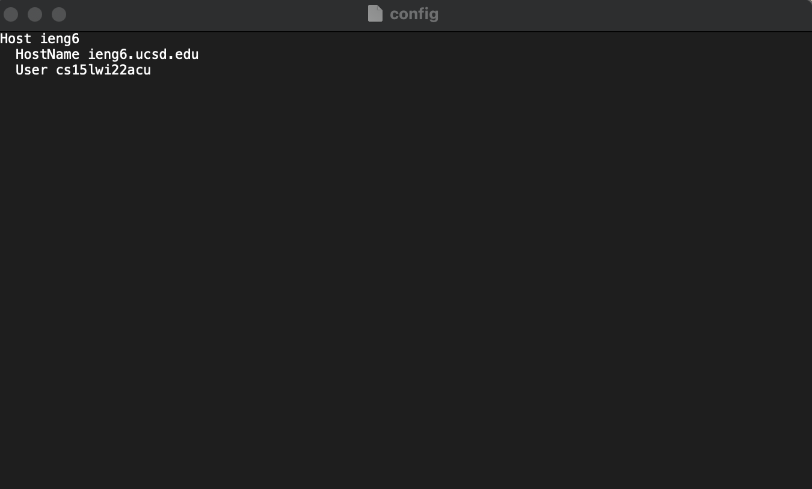
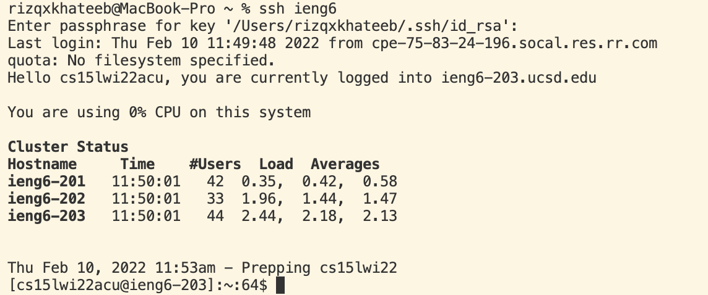
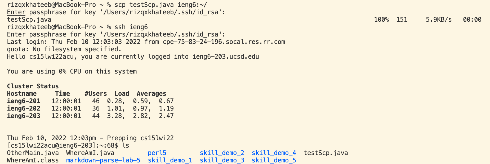

# Lab Report 3

### I did Option 1: Streamlining ssh configuration

- I opened the `ssh/config` file using the terminal on my computer, and then inputted the necessary information.
- This file is what ultimately allows for the streamlining of ssh, without putting in my whole username.

- Next, I used the `ssh` command to log in and successfully streamlined the configuration.
- When called, ssh was opened for my particular account.

- I created a file in java called `testScp`, and then used the streamlined configuration to call `scp` and copy the file over to ieng6. When checked, it was present in my ieng6 account.
- This means I could now run and compile the file, and edit within ieng6 if I wanted to.

