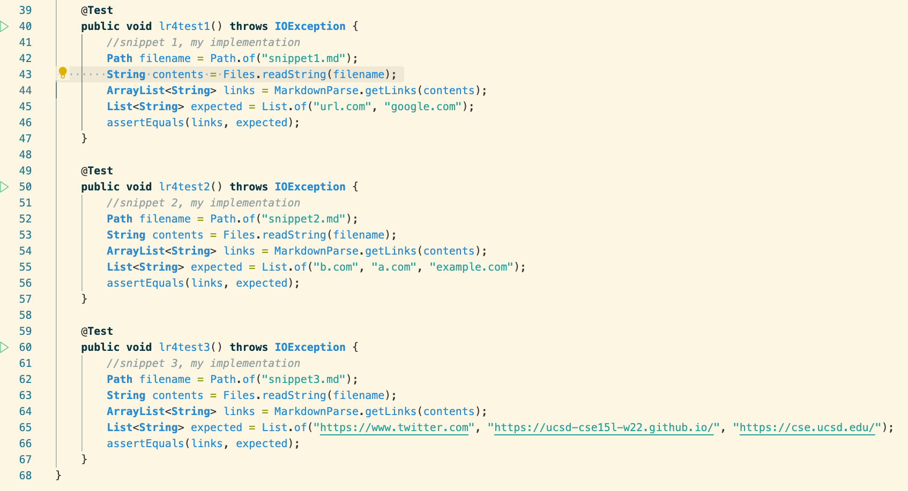
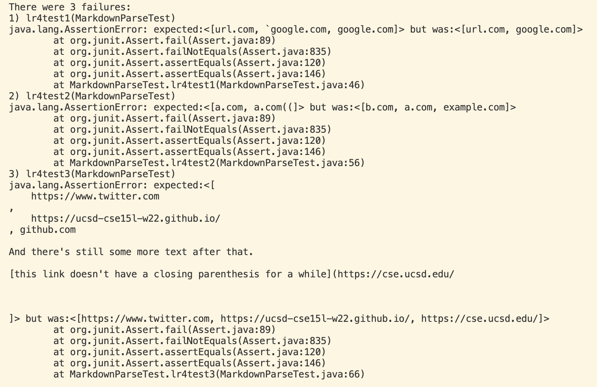
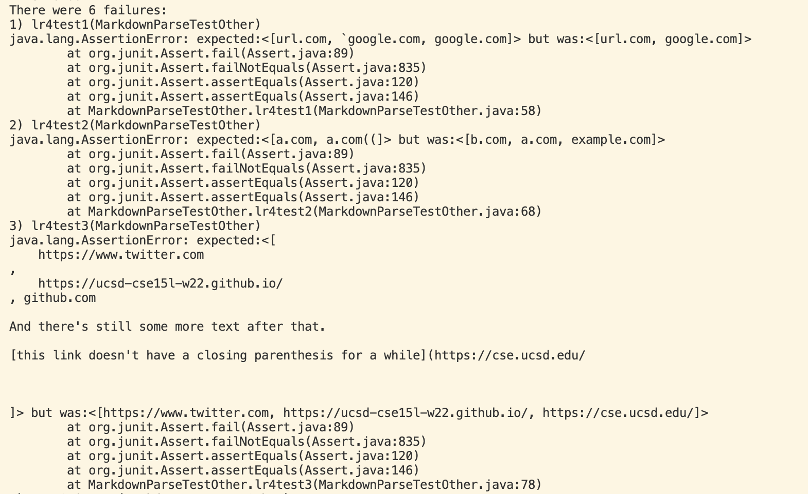

# Lab Report 4

[My markdown-parse repo](https://github.com/rkhateeb/markdown-parse)

[Other markdown-parse repo I reviewed](https://github.com/alckasoc/markdown-parse)

### Implementation of Tests for Snippets

### Results after running my markdown-parse
Failed

### Results after running other person's markdown-parse
Failed

### Snippet 1
- For this snippet, I think the fix would be pretty simple. We simply need to check for any symbols that are not accepted in links. In this case, it would be the ' before google, as this isn't a valid symbol for links.

### Snippet 2
- For this snippet, I think the change would be more involved, yet still doable. We need to once again check for invalid symbols. The parantheses present in the second link cause the third link to not be displayed. This change is possible, but I cannot guarantee it'll take less than 10 lines.

### Snippet 3
- This change would definitely require a lot of work, and would consequently not be short. The links with line breaks would be an easier fix, but the one with no parentheses after would definitely require a solid amount of code to implement and fix in a way that meets our expected output.