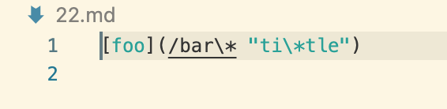
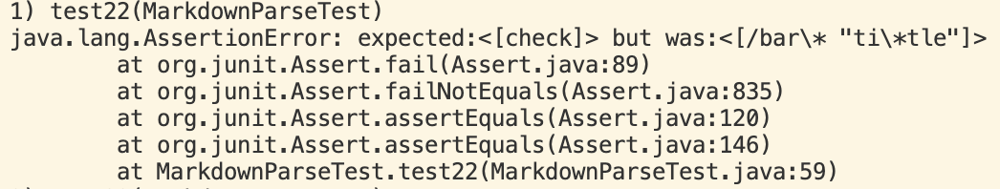
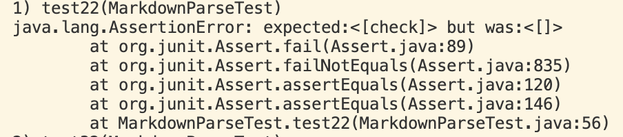
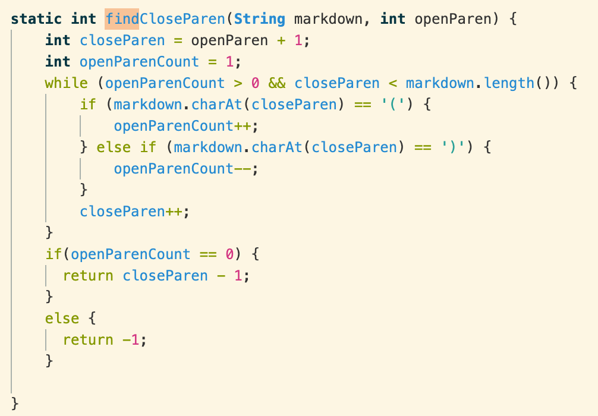
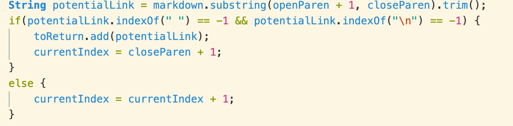
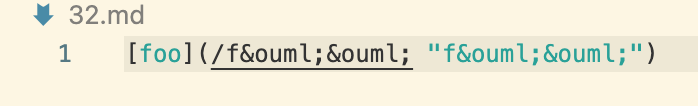
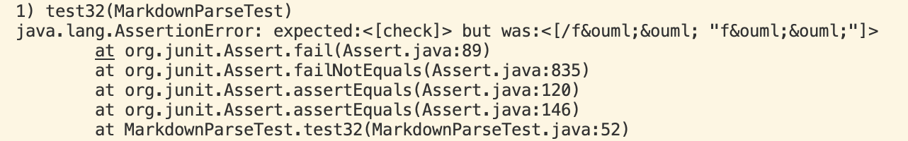
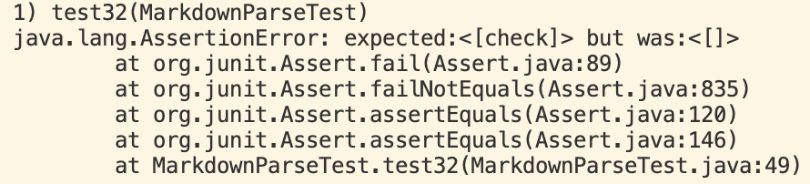

# Lab Report 5

I found the tests by searching through manually. I was primarily looking for tests that had significantly different data inside, yet would also return different results when implemented with MarkdownParse. Based on my search, I found that the tests 22.md and 32.md had different results with my implementation and the provided implementation.

## Test 1: 22.md

#### Results with my implementation:

#### Results with provided implementation:

- In this case, the provided implementation is correct. This is not a link and should not be recognized as one. Thus, no links should be returned. My implementation, however, interpreted the data in the file as a link, which is incorrect.
- The use of the findCloseParen in the provided implementation, along with potentialLink on line 74 of the provided implementations's MarkdownParse.java most likely helped with checking whether the file acutally contained a link or not. My implementation simply checked for brackets and what was inside them. The provided implementation goes a step further and checks what is actually inside the link brackets.

- Adding these pieces of code to my implementation would solve the problem and return the linkas non-existent, which is what the provided implementation returns and is correct.

## Test 2: 32.md

#### Results with my implementation:

#### Results with provided implementation:

- Once again, the provided implementation is correct. This is not a link and should not be recognized as one. Thus, no links should be returned. My implementation interpreted the data in the file as a link, which is incorrect.
- The use of the findCloseParen in the provided implementation, along with potentialLink on line 74 of the provided implementations's MarkdownParse.java most likely helped with checking whether the file acutally contained a link or not. My implementation simply checked for brackets and what was inside them. The provided implementation goes a step further and checks what is actually inside the link brackets. The issue is similar to that found when using 22.md, which makes sense because the files actually have a great deal of similarity.

- Adding these pieces of code to my implementation would solve the problem and return the linkas non-existent, which is what the provided implementation returns and is correct.